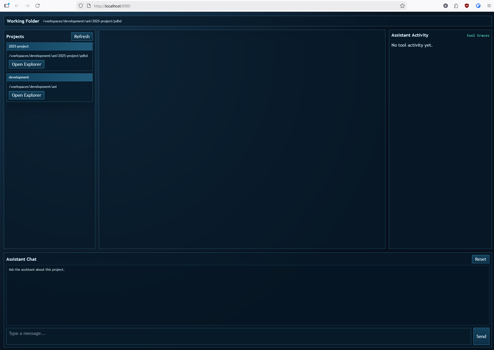

# Project Discovery in High Definition (PDHD)

PDHD is a Quarkus application for inspecting the local filesystem, documenting the files and folders inside software projects, and building reusable knowledge about known projects and their purposes.

The main product goal is project inspection rather than generic chat: point PDHD at a directory, explore its files and folders, and produce evidence-grounded summaries of what the project is, how it is organised, and what state it appears to be in.

The current stretch goal is AI-assisted completion estimation: using the accumulated project evidence to estimate how complete a project is and what work most likely remains.

## What PDHD Does

- Explore local folders and registered project roots through a web UI and assistant endpoints.
- Generate folder-level and project-level markdown documentation grounded in retrieved evidence.
- Persist project summaries and embedding-backed recall so known projects can be re-inspected later.
- Estimate likely next implementation steps from current project evidence.
- Prepare the groundwork for future AI-based completion estimation.

## Versioning Note

During the rewrite phase of this application, the working schema/version marker was `0.99.0`.
This explicitly denotes a pre-release stabilization cycle before the first stable `1.0.0` release.

## Prerequisites

- Java 25
- Node.js and npm (for frontend development/build)
- Optional: Ollama (for assistant chat features)
- Optional: GitHub CLI (`gh`) for GitHub repository metadata lookup

## Run in Development Mode

```sh
./mvnw quarkus:dev
```

The app runs on `http://localhost:8080`.

## Build and Run the Runnable JAR

Build:

```sh
./mvnw package
```

Run:

```sh
java -jar target/pdhd-0.1.0-runner.jar
```

The jar starts in production mode and listens on `http://0.0.0.0:8080`.

## Application Modes

When started, the CLI shows:

- `1` Launch assistant
- `2` Launch web UI
- `3` Configure Ollama
- `4` Configure system prompt
- `5` Exit

## Web UI Notes

See `docs/frontend.md` for detailed frontend architecture, API integration, state model, and development workflow.
For an end-to-end runtime narrative from launch to assistant functionality requests, see `docs/assistant-request-flow.md`.
For assistant tooling internals and report-ready architecture notes, see `docs/tool-calling-architecture.md`.
For backend constants and extensibility patterns, see `docs/support-classes.md`.
For the assistant TUI behaviour specification and pre-rewrite architecture review, see `docs/assistant-menu-rewrite-spec.md`.

- The top bar shows the current working folder.
- The left-hand `File Browser` is a compact explorer-style list for the current working folder.
- Clicking `Refresh` in the file browser calls `/api/fs/list` for the current folder.
- Clicking `Up` changes the working folder to the parent directory.
- Clicking a folder row in the file browser navigates into that folder.
- Directory rows that resolve to a valid GitHub repository link show a visible `↗` pop-out button that opens the repository in the browser.
- The project explorer window remains action-oriented:
  - `▸` folder runs a one-shot assistant summary for that folder
  - `●` file opens file content
- Project discovery still starts from the current working folder and discovers Git projects recursively via `/api/projects`.
- Known projects can then be inspected repeatedly so PDHD can refine and recall their documented purpose over time.

## Screenshots

Add screenshots to `docs/screenshots/` and update the image links below.

### Main Workspace



### Project Explorer and File View


### Folder Summary Interaction


### Assistant Chat Panel


## Assistant Tools Added

The assistant now includes additional exploration/navigation tools:

- `list_files_recursive`: recursively lists files in a folder.
- `analyze_path_detailed`: detailed analysis of a file or directory.
- `summarize_path`: concise summary of a file or directory.
- `change_working_directory`: changes the assistant working directory (absolute or relative path).

Older alias names such as `list_folder`, `explain_tool`, `summarise_tool`, and `navigate_tool` remain supported for compatibility with earlier chat history.

After `change_working_directory` runs:

- `get_current_working_directory` reflects the new working directory.
- Path-based tools default to the new working directory when `path` is omitted.
- The Web UI "Working Folder" display updates via `/api/cwd` polling.

## Run Tests

Run all tests:

```sh
./mvnw test
```

Run a focused test class:

```sh
./mvnw -Dtest=ProjectApiResourceTest test
```

## Build Frontend Assets

For full frontend setup and architecture notes, see `docs/frontend.md`.

```sh
cd src/main/webui
npm install
npm run build
```

## Troubleshooting

- If assistant model calls fail, verify Ollama endpoint/model settings in the configuration menu.
- If no projects appear, click `Refresh`; the current working folder should be auto-added on first run.
- If the repository pop-out button is not shown for a folder, verify that the directory is a Git repository with a browsable `http` or `https` remote.
