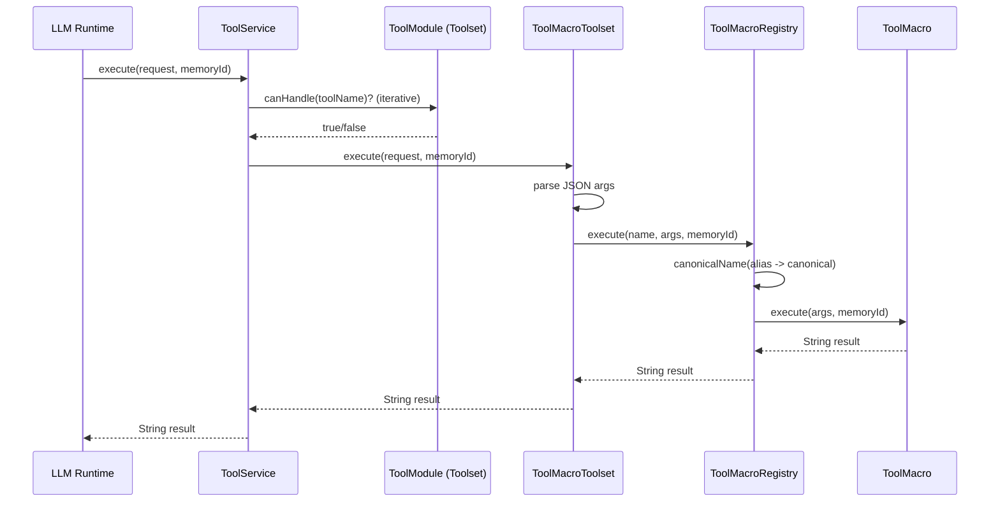

# Tool Calling Architecture

## Purpose

This document explains the current PDHD tool-calling architecture in a form
that can be reused in an academic report. It focuses on runtime control flow,
modularity decisions, data persistence, and engineering trade-offs.

## Scope

The architecture described here covers:

- Tool registration and dispatch
- Per-tool execution model (macro pattern)
- Alias/canonical name resolution
- Error and transaction behavior
- Read-context caching into persistent project knowledge

## Architectural Overview

PDHD uses a layered architecture for tool execution:

1. A service-level dispatcher selects a module that can handle a tool name.
2. Each module (toolset) delegates to a registry of single-purpose tool macros.
3. Each macro validates/reads arguments and executes one cohesive behavior.

Core classes:

- `ToolService` (service entry point and transactional boundary)
- `ToolModule` (module abstraction)
- `ToolMacroToolset` (base class implementing tool provider + executor)
- `ToolMacroRegistry` (name-to-macro lookup and execution)
- `ToolMacro` / `ToolMacroDefinition` / `ToolMacros` (tool contracts and aliases)

## Module Structure

Tool functionality is split into four main modules:

- Explore toolset: filesystem discovery/navigation and path analysis
- Read toolset: file reads
- Write toolset: controlled output generation and persistence tools
- Introspect toolset: session/project introspection and manifest views

Each toolset extends `ToolMacroToolset` and contributes a list of concrete
macro classes.

## Execution Flow

### Request Path

Given a `ToolExecutionRequest`, the runtime flow is:

1. `ToolService.execute(request, memoryId)` iterates over available `ToolModule`
   instances.
2. The first module where `canHandle(request.name())` is true is selected.
3. Module-level `execute` parses JSON arguments via `ToolArguments.parse(...)`.
4. `ToolMacroRegistry` resolves aliases/keyphrases to a canonical tool name.
5. The matching `ToolMacro` executes and returns a string result.

### Sequence Diagram

## Macro Pattern Rationale

The current design uses one class per tool operation instead of large switch
blocks. This provides:

- High cohesion: each macro has one responsibility
- Low coupling: independent evolution of tools
- Better testability: tool-level and support-level isolation
- Safer refactoring: fewer shared mutation points

## Naming and Alias Resolution

Canonical tool names are defined in `ToolMacros`.

- Each tool has a canonical machine name (for example, `summarize_path`).
- Each tool may also define invocation keyphrases/legacy aliases.
- `ToolMacroRegistry` lowercases and trims names before lookup.

This preserves backward compatibility for older prompts/chat history while
standardizing internal execution on canonical names.

## Error and Failure Model

Error handling is intentionally defensive and string-based for LLM readability:

- Unknown tool: `Unknown tool: <name>`
- Argument parse failure: `Invalid tool arguments: ...`
- Runtime tool error: `Tool execution failed for <name>: ...`

Individual tools may return domain-specific failure messages (for example,
path validation or file-not-found errors).

## Transaction and Persistence Semantics

`ToolService.execute(...)` is annotated as transactional. Therefore, tool
execution and persistence writes occur inside a single transaction scope.

### Read Context Caching

Read-oriented tools now persist discovered context through `ReadToolSupport`.
This allows later tools to operate on prior observations without requiring
re-reading all artifacts.

Current cache entry types in `ProjectKnowledge` include:

- `file:<relativePath>` for full file contents
- `path:summary:<absolutePath>` for path summaries
- `path:detailed:<absolutePath>` for detailed analyses
- `folder:<absolutePath>` for folder manifest snapshots

Caching is best-effort by design: cache-write failures are swallowed so the
primary user-facing tool result is not lost.

## Security and Robustness Controls

Notable safeguards include:

- Path traversal checks for project-scoped file operations
- Directory existence/type checks before recursive operations
- Directory ignore rules for expensive/non-relevant trees
  (for example: `.git`, `node_modules`, `target`, `build`)
- Output truncation/sampling in manifest-style tools to control context volume

## Testability and Evidence

The architecture is covered by both contract tests and toolset-specific tests.
In particular, read-context persistence is validated by dedicated end-to-end
tests that assert database writes after tool invocation.

For report usage, this supports claims about:

- Deterministic dispatch behavior
- Backward-compatible alias handling
- Transactional execution integrity
- Empirical verification of persistence side effects

## Known Limitations

- Module dispatch currently uses first-match iteration, so module ordering
  matters if duplicate names are introduced.
- Tool inputs/outputs are currently string-oriented, which is practical for LLM
  interaction but less type-safe for downstream programmatic clients.
- Cache invalidation is currently limited; stale snapshots are possible unless
  tools refresh relevant paths.

## Suggested Academic Framing

This architecture is suitable to describe as:

- A modular command-dispatch system for LLM tool orchestration
- A pragmatic hybrid of plugin pattern (`ToolModule`) and command pattern
  (`ToolMacro`)
- A transaction-scoped execution model with best-effort observational caching

Recommended report sections:

1. Problem and constraints (LLM-compatible tools, safety, maintainability)
2. Design alternatives considered (monolithic switch vs macro classes)
3. Final architecture and execution flow
4. Validation strategy (unit/integration tests)
5. Limitations and future work (typed responses, invalidation policy)
